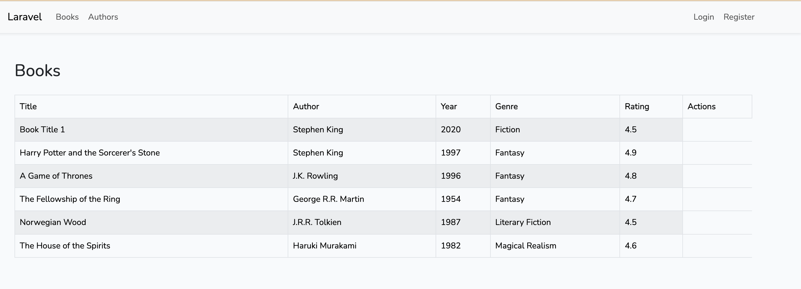
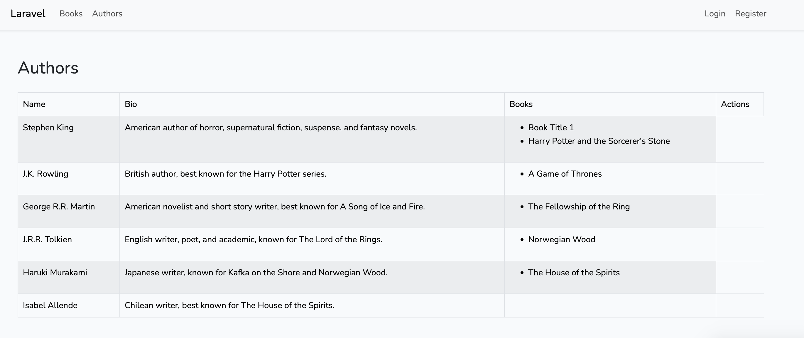
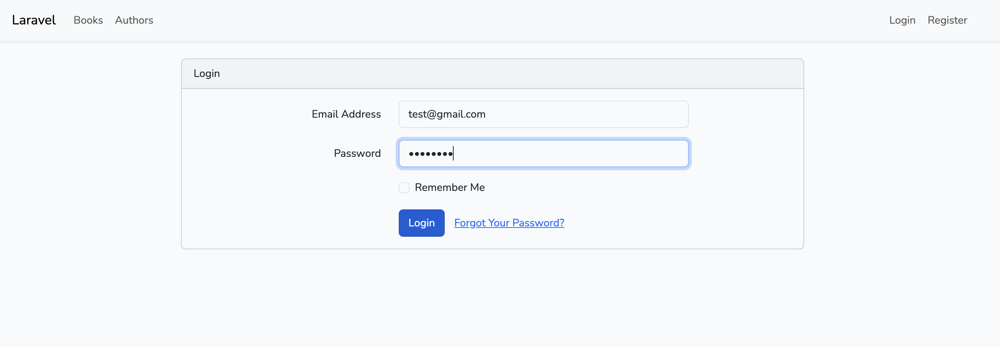
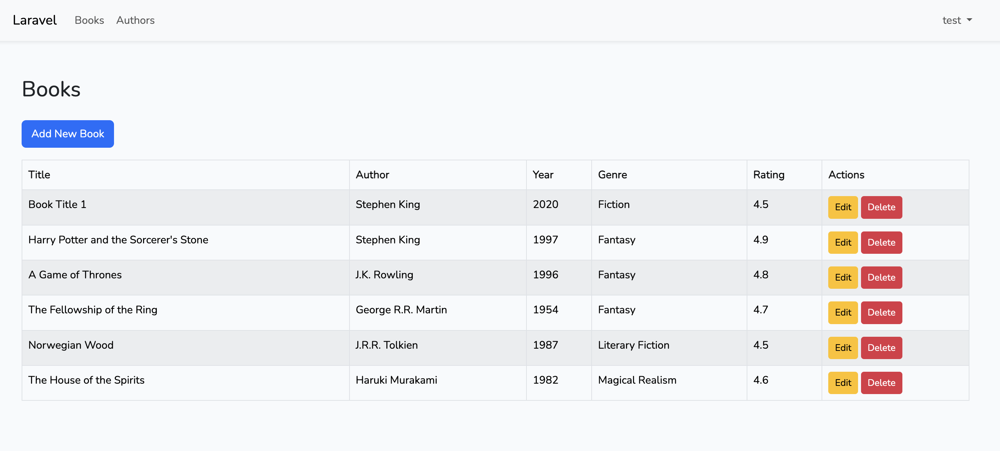
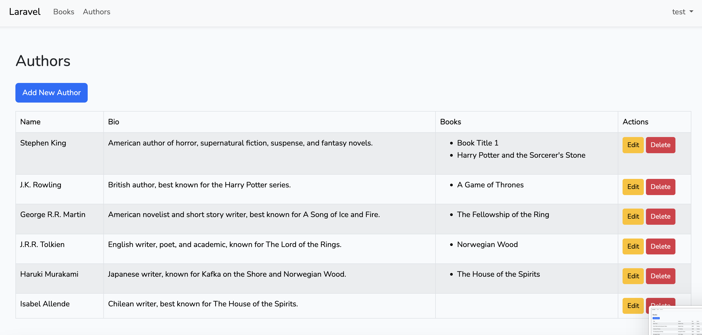
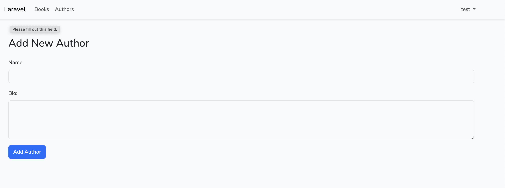
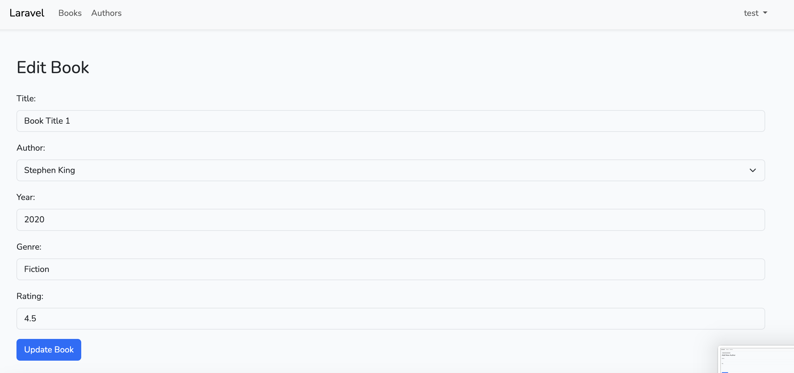
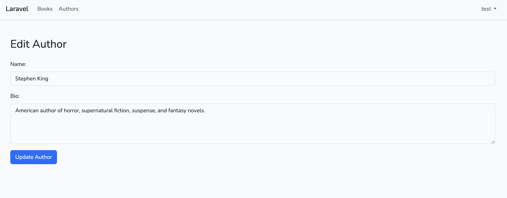
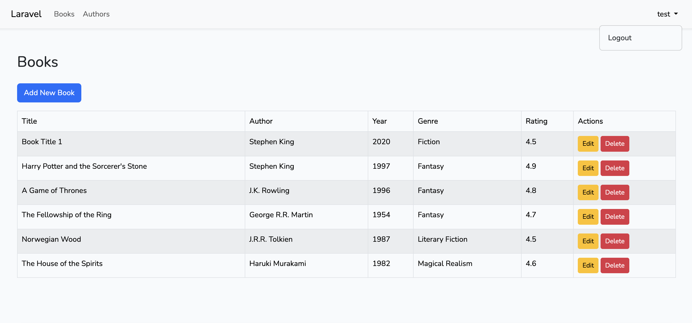

# Laravel Book & Author Management Application

This is a simple web application built using the **Laravel** framework. It allows users to manage books and authors, where they can perform basic CRUD (Create, Read, Update, Delete) operations on both books and authors. The application also includes user authentication, allowing registered users to log in and manage the records.

## Features

- **Books Management**: Users can add, edit, view, and delete books.
- **Authors Management**: Users can add, edit, view, and delete authors.
- **User Authentication**: Users can register, log in, and log out.
- **Responsive Design**: The application is styled using **Bootstrap** for a responsive and modern design.

## Technologies Used

- **Laravel** (PHP framework)
- **Bootstrap** (CSS framework)
- **MySQL** (Database)
- **Vite** (Asset bundler)
- **Blade** (Templating engine)

## Database Schema

### Tables:

1. **Authors**
    - `id`: Primary key (integer, auto-increment)
    - `name`: Author's name (string)
    - `bio`: Author's biography (text)
    - `timestamps`: Laravel's created_at and updated_at fields.

2. **Books**
    - `id`: Primary key (integer, auto-increment)
    - `title`: Book title (string)
    - `author_id`: Foreign key referencing `authors.id` (integer)
    - `year`: Year of publication (integer)
    - `genre`: Genre of the book (string)
    - `rating`: Rating out of 5 (decimal)
    - `timestamps`: Laravel's created_at and updated_at fields.

### Relationships:
- **One-to-Many**: An author can have many books, but a book belongs to one author.

## Installation and Setup

To run this project locally, follow these steps:

1. Clone the repository:

    ```bash
    git clone https://github.com/your-username/laravel-book-author-management.git
    cd laravel-book-author-management
    ```

2. Install dependencies via Composer:

    ```bash
    composer install
    ```

3. Install npm dependencies for front-end assets:

    ```bash
    npm install
    ```

4. Create a `.env` file by copying the `.env.example`:

    ```bash
    cp .env.example .env
    ```

5. Generate the application key:

    ```bash
    php artisan key:generate
    ```

6. Configure your `.env` file with your database credentials:

    ```dotenv
    DB_CONNECTION=mysql
    DB_HOST=127.0.0.1
    DB_PORT=3306
    DB_DATABASE=your_database_name
    DB_USERNAME=your_database_username
    DB_PASSWORD=your_database_password
    ```

7. Run database migrations:

    ```bash
    php artisan migrate
    ```

8. Seed the database with some example data (optional):

    ```bash
    php artisan db:seed
    ```

9. Compile the front-end assets:

    ```bash
    npm run dev
    ```

10. Serve the application locally:

    ```bash
    php artisan serve
    ```

11. Visit the application in your browser:

    ```
    http://localhost:8000
    ```

## Usage

Once the application is up and running, users can:
- **View books and authors** without being logged in.
- **Log in** to manage books and authors.
- **Create**, **edit**, and **delete** books and authors after logging in.

## Screenshots













## Issues and Contributions

If you encounter any issues or bugs, feel free to open an issue or submit a pull request. Contributions are welcome!

## License

This project is licensed under the MIT License - see the [LICENSE](LICENSE) file for details.
